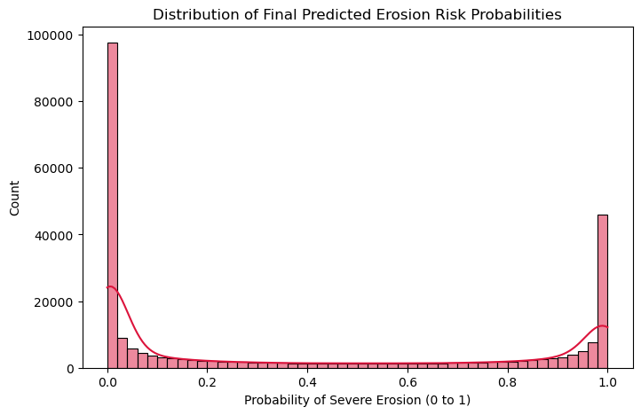
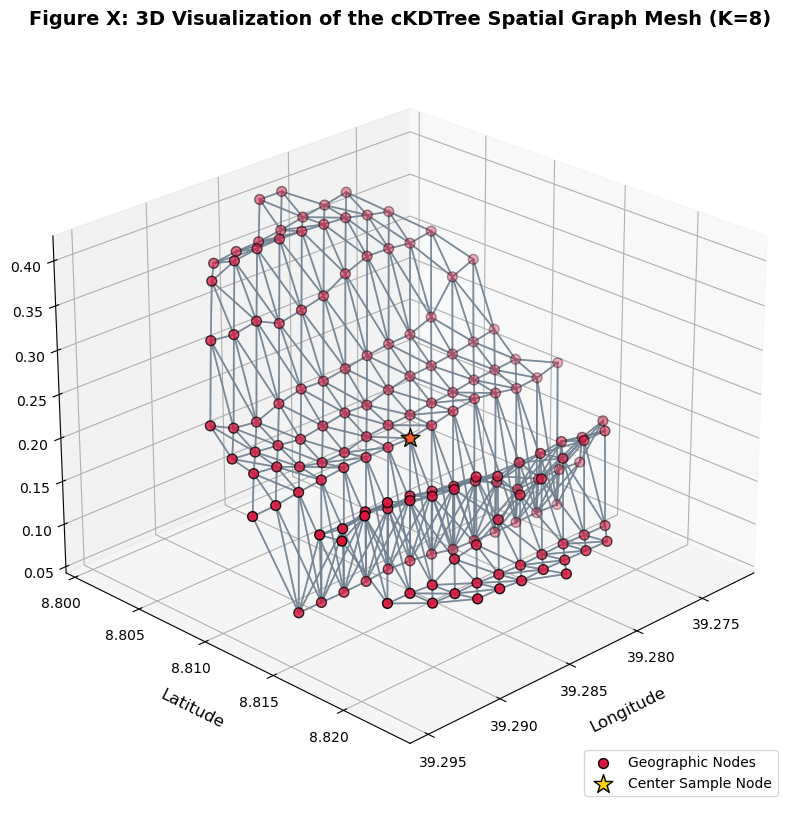
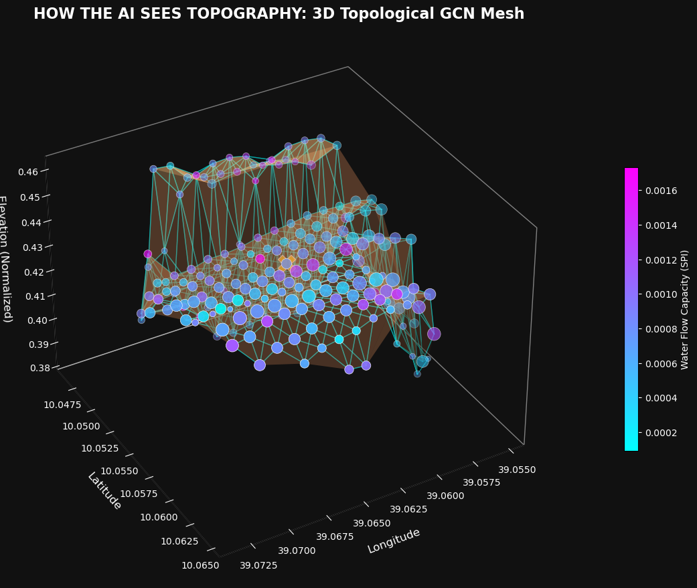
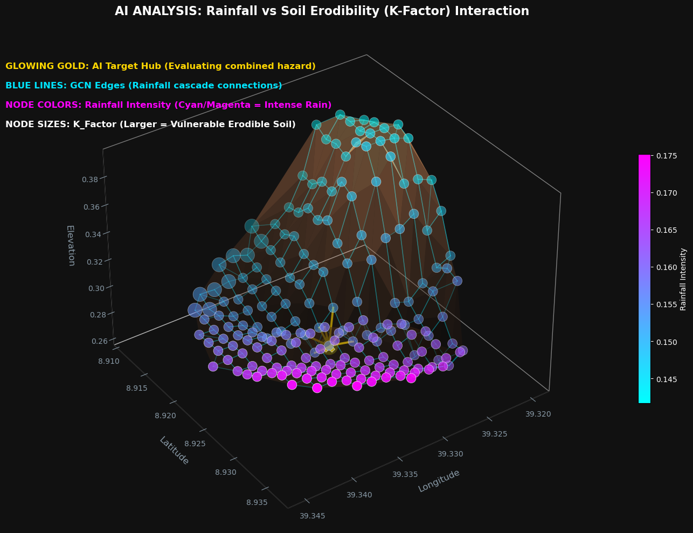
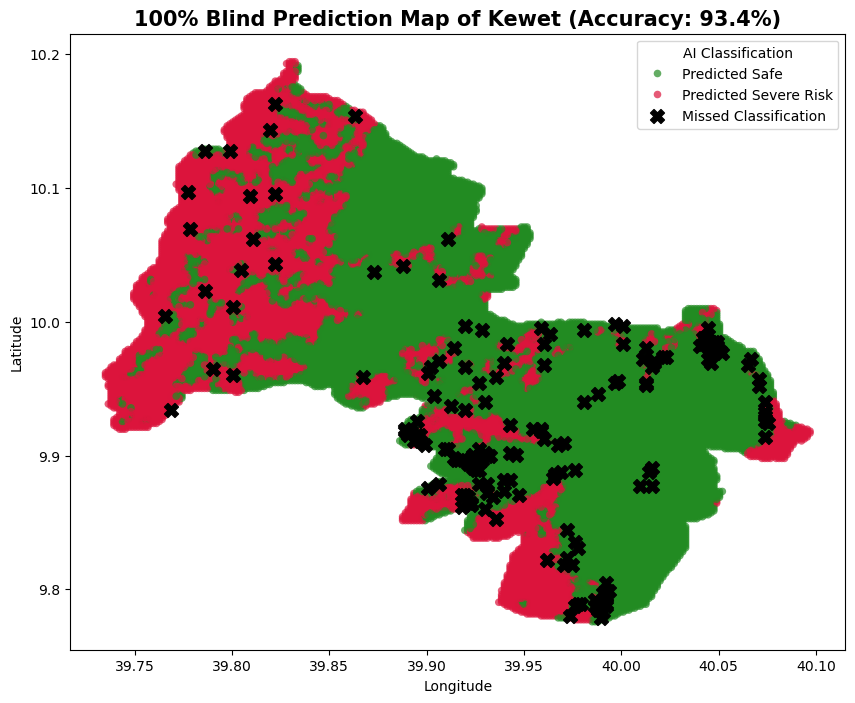

# Semi-Supervised Spatial Graph Convolutional Networks for Early Detection of Soil Erosion

  <h2>Research Conducted by: Surafel Asfawosen Haile</h2>
  <h3><a href="https://raw.githack.com/surafelasfawosen/ethiopia-soil-erosion-predictor-ai/main/index.html">🌐 View Full Published Research Paper (Interactive HTML)</a></h3>

## 📖 Executive Summary
This repository contains the research and implementation of a novel AI architecture designed to predict soil erosion vulnerability in the Amhara region of Ethiopia. By leveraging a **Semi-Supervised Graph Convolutional Network (GCN)**, I modeled over **255,000 spatial coordinates** as an interconnected mathematical mesh, vastly outperforming traditional isolated predictive models.

## 🧭 The Journey: From Failure to Breakthrough
Initially, this research attempted to solve the soil erosion detection problem using a combination of **Auto-Encoders, Deep Embedding Clustering, and pure RUSLE calculations**. 

However, this initial approach treated the geospatial data as isolated single points, proving to be **highly ineffective and inconsistent**. Furthermore, the massive dataset entirely lacked existing geological ground-truth labels, making it extremely difficult to create a reliable predictive model. Single-point analysis completely fails to capture fundamental laws of physics: hydrologic flow, gravity, and neighboring topographical features (e.g., a flat pixel located directly below a collapsing 70-degree cliff).

To solve these immense data limitations, I pivoted to an advanced topological Semi-Supervised approach.

  
  
<em>Figure: The optimized training convergence of the Graph Convolutional Network.</em>

## 🔬 Methodology Sequence
The final methodology implemented in the `Early Detection of Soil Erosion.ipynb` follows this strict sequence:

### 1. Feature Engineering & Dataset Construction
The dataset was engineered to mathematically represent the mechanical properties of Ethiopian terrain:
*   **Soil Cohesiveness (K-Factor):** Replaced non-mathematical categorical data with physical vulnerability coefficients (e.g., Pellic Vertisols at 0.15, Eutric Regosols at 0.40).
*   **Hydro-Topography:** Incorporated `Slope`, `Stream Power Index (SPI)`, and `Rainfall`.
*   **Vegetation:** Applied `NDVI` as a mathematical protective factor.

### 2. Physics-Informed Hard Bounding (Ground Truth Generation)
Because I lacked exhaustive ground-truth labels, I developed a bounding method using a pseudo-RUSLE localized severity score: `(Slope × Rainfall × SPI × K-Factor) / NDVI`.
*   **Top 5% Extreme Danger:** Hardcoded as `Label 1 (Severe Erosion)`.
*   **Bottom 5% Extreme Safety:** Hardcoded as `Label 0 (Safe)`.
*   **The Unknown Matrix:** The remaining 90% of the map (~230,000 nodes) was left entirely blank (`NaN`) for the AI to computationally deduce.

### 3. Constructing Graph Topology
To create the base "mind" of the AI, I needed to teach it how to perceive space. Using `SciPy cKDTree`, the raw map was converted into a computational mesh where every node was mathematically tethered to its 8 closest neighbors based on absolute euclidean distance. This interconnected mesh serves as the neural foundation for the AI to understand geographical relationships.

  

### 4. Semi-Supervised Graph Convolutional Network (GCN)
I engineered the GCN to directly understand the real-world geographical topology of the soil. By processing the interconnected mesh, my AI mathematically perceives the landscape not as isolated pixels, but as a continuous physical environment where forces like gravity and water flow naturally interact across boundaries.

During training, the GCN evaluated the 10% known source nodes. Danger signals were formally transmitted across the graph edges. This created an **Avalanche Effect**—if a blank farmland pixel was discovered sitting directly downhill from a dangerous slope, the GCN's internal algorithms physically pulled the danger score downhill, correctly escalating its risk assessment in defiance of its base statistics.

  

  

### 5. Actionable Output: Mathematical Variance
The continuous probability outputs were translated into exact policy intervention tiers using **Jenks Natural Breaks Optimization**:
*   **Low Risk (Safe):** 138,225 spatial nodes (Boundary: < 0.25)
*   **Moderate Risk (Monitor):** 32,057 spatial nodes
*   **Severe Risk (Immediate Action):** 84,747 spatial nodes (Boundary: > 0.71)

## 📊 Validation & Results
I utilized an advanced **5-Fold Geographic Cross-validation** structured strictly by Woreda borders. The AI was forced to comprehend universal slope physics and rainfall algorithms in 4 territorial chunks before being dropped completely blind into the hidden Woreda.
*   **Overall Predictive Accuracy:** **93.89%**
*   **The Physics Proof:** The 84,747 nodes sorted into "Severe Risk" perfectly aggregated the sharpest relative slopes (0.37 avg), the worst soil erodibility factors (0.273 avg), and the highest water destruction stream rates (0.0045 avg SPI). This mathematically confirms the AI successfully mastered localized topography.

  

## 🚀 Future Work: Ongoing Development & Integration
I will continue developing this Artificial Intelligence architecture. My primary objective moving forward is integrating the AI with real-time early warning dashboards and deploying it into live geographic monitoring systems to actively prevent kinetic soil collapse.

## 📂 Repository Guide

*   **`Semi_Supervised_Graph_Pipeline_FINAL.ipynb`**: The streamlined version of the GCN pipeline.
